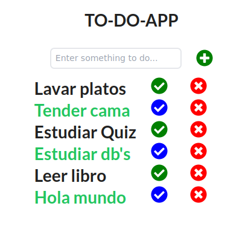

# TODO_frontend

<h1>📓TO-DO APP📓</h1>

TO DO app with MERN stack.

<h1>Librerias 📕</h1>

<ul>
    <li>npm install react-icons --save</li>
    <li>npm install axios</li>
</ul>

<h1>Construido con 🔧</h1>

<ul>
    <li>React js</li>
    <li>Tailwind CSS</li>
</ul>

<h1>Autores ✒️</h1>

<ul>
    <li>María José Alba</li>
</ul>

<h1>Deploy 🖥️</h1>

<ul>
    <li>https://harmonious-gingersnap-223c9e.netlify.app/</li>
</ul>
